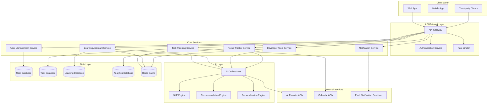

# Design Document

## Overview

ProductivityBuddy is designed as a cloud-native, AI-powered productivity platform that combines task management, learning assistance, developer tools, focus tracking, and progress analytics. The system employs a microservices architecture to ensure scalability, maintainability, and independent deployment of features. The platform leverages modern AI capabilities for personalization while maintaining high performance and security standards.

The architecture supports 100,000+ concurrent users with sub-2-second response times through intelligent caching, horizontal scaling, and optimized AI inference pipelines. The system integrates with external tools and provides comprehensive APIs for third-party integrations.

## Architecture

### High-Level Architecture

The system follows a microservices architecture pattern with the following key principles:

- **Domain-Driven Design**: Services are organized around business capabilities
- **API-First**: All services expose well-defined REST APIs
- **Event-Driven Communication**: Asynchronous messaging for loose coupling
- **Cloud-Native**: Designed for containerized deployment and auto-scaling
- **Security by Design**: Zero-trust security model with end-to-end encryption



### Service Architecture Patterns

**Microservices Communication**:
- Synchronous: REST APIs for real-time operations
- Asynchronous: Event streaming via Apache Kafka for data consistency
- Circuit breakers and retry mechanisms for resilience

**Data Architecture**:
- Database per service pattern for data isolation
- Event sourcing for audit trails and data recovery
- CQRS (Command Query Responsibility Segregation) for read/write optimization

**Scalability Patterns**:
- Horizontal pod autoscaling based on CPU/memory metrics
- Database sharding for large datasets
- CDN for static content delivery
- Intelligent caching with Redis for frequently accessed data

## Components and Interfaces

### Core Services

#### 1. Task Planning Service
**Responsibilities**:
- Goal decomposition and task generation
- Intelligent scheduling and prioritization
- Deadline management and conflict resolution
- Integration with external calendar systems

**Key Interfaces**:
```typescript
interface TaskPlanningService {
  decomposeGoal(goal: Goal, deadline: Date, userContext: UserContext): Task[]
  generateSchedule(tasks: Task[], constraints: SchedulingConstraints): Schedule
  adjustSchedule(schedule: Schedule, changes: ScheduleChange[]): Schedule
  getPrioritizedTasks(userId: string, timeframe: TimeFrame): Task[]
}

interface Goal {
  id: string
  title: string
  description: string
  deadline: Date
  complexity: ComplexityLevel
  category: string
}

interface Task {
  id: string
  goalId: string
  title: string
  description: string
  estimatedDuration: number
  priority: Priority
  dependencies: string[]
  scheduledTime?: Date
}
```

#### 2. Learning Assistant Service
**Responsibilities**:
- Personalized study plan generation
- Knowledge gap identification and tracking
- Multi-level concept explanations
- Progress assessment and adaptation

**Key Interfaces**:
```typescript
interface LearningAssistantService {
  generateStudyPlan(topic: string, userProfile: LearningProfile): StudyPlan
  explainConcept(concept: string, difficultyLevel: DifficultyLevel): Explanation
  identifyKnowledgeGaps(assessmentResults: AssessmentResult[]): KnowledgeGap[]
  adaptLearningPath(userId: string, progressData: ProgressData): StudyPlan
}

interface StudyPlan {
  id: string
  topic: string
  milestones: Milestone[]
  estimatedDuration: number
  difficulty: DifficultyLevel
  resources: LearningResource[]
}

interface LearningProfile {
  userId: string
  learningStyle: LearningStyle
  preferredPace: LearningPace
  knowledgeAreas: KnowledgeArea[]
  weaknesses: string[]
  strengths: string[]
}
```

#### 3. Developer Tools Service
**Responsibilities**:
- Code generation and explanation
- Debugging assistance and error analysis
- API documentation summarization
- Code quality assessment

**Key Interfaces**:
```typescript
interface DeveloperToolsService {
  generateCode(prompt: string, language: ProgrammingLanguage, context?: CodeContext): CodeGeneration
  explainCode(code: string, language: ProgrammingLanguage): CodeExplanation
  debugCode(code: string, error: string, language: ProgrammingLanguage): DebuggingSuggestion[]
  summarizeDocumentation(documentation: string, focusArea?: string): DocumentationSummary
}

interface CodeGeneration {
  code: string
  explanation: string
  language: ProgrammingLanguage
  confidence: number
  alternatives?: string[]
}

interface DebuggingSuggestion {
  issue: string
  severity: SeverityLevel
  suggestion: string
  codeExample?: string
}
```

#### 4. Focus Tracker Service
**Responsibilities**:
- Pomodoro session management
- Distraction detection and analysis
- Productivity metrics calculation
- Habit tracking and streak management

**Key Interfaces**:
```typescript
interface FocusTrackerService {
  startFocusSession(userId: string, sessionType: SessionType, duration: number): FocusSession
  recordDistraction(sessionId: string, distraction: Distraction): void
  calculateProductivityMetrics(userId: string, timeframe: TimeFrame): ProductivityMetrics
  trackHabit(userId: string, habit: Habit, completed: boolean): HabitProgress
}

interface FocusSession {
  id: string
  userId: string
  startTime: Date
  plannedDuration: number
  actualDuration?: number
  distractions: Distraction[]
  productivity: number
}

interface ProductivityMetrics {
  focusTime: number
  distractionCount: number
  completedTasks: number
  productivityScore: number
  trends: ProductivityTrend[]
}
```

#### 5. Notification Service
**Responsibilities**:
- Intelligent notification scheduling
- Multi-channel delivery (push, email, SMS)
- User preference learning and adaptation
- Notification analytics and optimization

**Key Interfaces**:
```typescript
interface NotificationService {
  scheduleNotification(notification: Notification, deliveryTime: Date): void
  sendImmediateNotification(notification: Notification): DeliveryResult
  updateUserPreferences(userId: string, preferences: NotificationPreferences): void
  analyzeNotificationEffectiveness(userId: string): NotificationAnalytics
}

interface Notification {
  id: string
  userId: string
  type: NotificationType
  title: string
  message: string
  channels: DeliveryChannel[]
  priority: Priority
  context?: NotificationContext
}
```

### AI Layer Components

#### AI Orchestrator
Central coordinator for all AI operations, managing model selection, request routing, and response aggregation.

**Capabilities**:
- Model selection based on task requirements
- Load balancing across AI providers
- Response caching and optimization
- Fallback handling for AI service failures

#### Personalization Engine
Learns user behavior patterns and preferences to provide tailored experiences.

**Features**:
- Collaborative filtering for recommendation generation
- Behavioral pattern analysis
- A/B testing framework for feature optimization
- Real-time preference adaptation

#### NLP Engine
Processes natural language inputs for task creation, learning queries, and code explanations.

**Components**:
- Intent recognition and entity extraction
- Context-aware response generation
- Multi-language support
- Sentiment analysis for user feedback

## Data Models

### Core Data Entities

#### User Profile
```typescript
interface UserProfile {
  id: string
  email: string
  name: string
  timezone: string
  preferences: UserPreferences
  learningProfile: LearningProfile
  productivityProfile: ProductivityProfile
  createdAt: Date
  lastActiveAt: Date
}

interface UserPreferences {
  notifications: NotificationPreferences
  privacy: PrivacySettings
  integrations: IntegrationSettings
  ui: UIPreferences
}
```

#### Task and Goal Models
```typescript
interface Goal {
  id: string
  userId: string
  title: string
  description: string
  category: string
  deadline: Date
  status: GoalStatus
  complexity: ComplexityLevel
  tasks: Task[]
  createdAt: Date
  updatedAt: Date
}

interface Task {
  id: string
  goalId: string
  userId: string
  title: string
  description: string
  status: TaskStatus
  priority: Priority
  estimatedDuration: number
  actualDuration?: number
  scheduledTime?: Date
  completedAt?: Date
  dependencies: string[]
  tags: string[]
}
```

#### Learning Data Models
```typescript
interface StudyPlan {
  id: string
  userId: string
  topic: string
  difficulty: DifficultyLevel
  milestones: Milestone[]
  progress: number
  estimatedCompletion: Date
  createdAt: Date
  updatedAt: Date
}

interface KnowledgeArea {
  id: string
  name: string
  mastery: number
  lastAssessed: Date
  relatedTopics: string[]
  resources: LearningResource[]
}

interface LearningSession {
  id: string
  userId: string
  studyPlanId: string
  duration: number
  topicsCovered: string[]
  comprehensionScore: number
  startTime: Date
  endTime: Date
}
```

#### Analytics and Metrics
```typescript
interface ProductivityMetrics {
  userId: string
  date: Date
  focusTime: number
  tasksCompleted: number
  distractionCount: number
  productivityScore: number
  learningHours: number
  codeGenerated: number
}

interface UserBehaviorEvent {
  id: string
  userId: string
  eventType: EventType
  timestamp: Date
  context: Record<string, any>
  sessionId: string
}
```

### Database Design

**User Service Database (PostgreSQL)**:
- User profiles and authentication data
- User preferences and settings
- ACID compliance for critical user data

**Task Service Database (PostgreSQL)**:
- Goals, tasks, and scheduling data
- Complex relationships and constraints
- Transactional consistency for task operations

**Learning Service Database (MongoDB)**:
- Study plans and learning resources
- Flexible schema for diverse content types
- Document-based storage for learning materials

**Analytics Database (ClickHouse)**:
- Time-series data for productivity metrics
- High-performance analytical queries
- Real-time aggregations and reporting

**Cache Layer (Redis)**:
- Session data and temporary state
- Frequently accessed user preferences
- AI response caching for performance

## Correctness Properties

*A property is a characteristic or behavior that should hold true across all valid executions of a system—essentially, a formal statement about what the system should do. Properties serve as the bridge between human-readable specifications and machine-verifiable correctness guarantees.*

Based on the prework analysis of acceptance criteria, the following properties ensure system correctness:

### Task Planning Properties

**Property 1: Task Decomposition Completeness**
*For any* goal with a deadline, all generated tasks should be specific (have clear, actionable descriptions) and time-bound (have deadlines that respect the original goal deadline)
**Validates: Requirements 1.1**

**Property 2: Schedule Constraint Satisfaction**
*For any* set of tasks with user availability, deadlines, and effort estimates, the generated schedule should never violate availability constraints, deadline constraints, or effort capacity limits
**Validates: Requirements 1.2**

**Property 3: Schedule Adaptation Consistency**
*For any* initial schedule and workload change, the adjusted schedule should maintain feasibility (all constraints satisfied) and improve or maintain optimality compared to the original schedule
**Validates: Requirements 1.3**

**Property 4: Overdue Task Recovery**
*For any* set of tasks with some marked as overdue, the system should always provide revised timelines that are achievable given current constraints and maintain task dependencies
**Validates: Requirements 1.4**

**Property 5: Task Quality Invariant**
*For any* goal decomposition operation, every generated task should meet actionability criteria (specific verb, clear outcome) and measurability criteria (definable completion state)
**Validates: Requirements 1.5**

### Learning Assistant Properties

**Property 6: Study Plan Personalization**
*For any* learning topic and user profile, the generated study plan should contain milestones appropriate to the topic complexity and personalization elements that reflect the user's learning style and pace
**Validates: Requirements 2.1**

**Property 7: Multi-Level Explanation Completeness**
*For any* concept explanation request, the system should provide explanations at exactly three difficulty levels (beginner, intermediate, advanced) with appropriate content complexity for each level
**Validates: Requirements 2.2**

**Property 8: Knowledge Gap Targeting**
*For any* set of assessment results indicating knowledge gaps, all recommended revision materials should be directly relevant to the identified gaps and appropriate for the user's current knowledge level
**Validates: Requirements 2.3**

**Property 9: Learning Progress Consistency**
*For any* completed study session, progress tracking should accurately reflect the session outcomes and future recommendations should be adjusted based on demonstrated learning patterns
**Validates: Requirements 2.4**

**Property 10: Knowledge Map Accuracy**
*For any* sequence of learning activities, the knowledge map should always accurately reflect the current mastery state of all topics, with mastered topics marked correctly and pending topics identified appropriately
**Validates: Requirements 2.5**

### Developer Tools Properties

**Property 11: Code Generation Quality**
*For any* code generation request in a supported language, the output should be syntactically correct according to the language specification and include explanatory comments or documentation
**Validates: Requirements 3.1**

**Property 12: Debugging Assistance Completeness**
*For any* code submission with errors, the system should identify at least one potential issue and provide actionable suggestions for resolution
**Validates: Requirements 3.2**

**Property 13: Documentation Summarization Accuracy**
*For any* API documentation input, the generated summary should highlight all key endpoints, essential usage patterns, and critical parameters while maintaining factual accuracy
**Validates: Requirements 3.3**

**Property 14: Code Explanation Depth**
*For any* code with complexity above a threshold, the explanation should provide line-by-line breakdowns for all complex logic sections
**Validates: Requirements 3.4**

**Property 15: Multi-Language Support Coverage**
*For any* supported programming language, all core developer tool functions (generation, explanation, debugging) should operate correctly and produce language-appropriate outputs
**Validates: Requirements 3.5**

### Focus Tracking Properties

**Property 16: Session Monitoring Accuracy**
*For any* focus session, the recorded duration should match the actual session time and all interruptions should be accurately tracked with timestamps
**Validates: Requirements 4.1**

**Property 17: Pomodoro Metrics Consistency**
*For any* completed Pomodoro session, productivity metrics should be calculated consistently using the same algorithm and break suggestions should be appropriate to the session outcome
**Validates: Requirements 4.2**

**Property 18: Distraction Pattern Recognition**
*For any* detected distraction pattern, the provided recommendations should be personalized to the user's specific distraction types and historically effective improvement strategies
**Validates: Requirements 4.3**

**Property 19: Habit Tracking Accuracy**
*For any* sequence of habit completion events, streak counters should be calculated correctly and achievement milestones should be triggered at the appropriate thresholds
**Validates: Requirements 4.4**

**Property 20: Productivity Report Completeness**
*For any* time period with productivity data, both weekly and monthly trend reports should be generated with accurate trend calculations and meaningful insights
**Validates: Requirements 4.5**

### Dashboard and Analytics Properties

**Property 21: Dashboard Data Accuracy**
*For any* user accessing the dashboard, all displayed metrics (task completion rates, learning hours, productivity scores) should accurately reflect the current state of user data
**Validates: Requirements 5.1**

**Property 22: Visualization Completeness**
*For any* progress data set, charts should be generated for all three required time periods (daily, weekly, monthly) with appropriate data aggregation for each period
**Validates: Requirements 5.2**

**Property 23: Learning Analytics Precision**
*For any* learning activity data, the displayed knowledge acquisition rates and topic mastery levels should accurately reflect the user's actual learning progress and assessment results
**Validates: Requirements 5.3**

**Property 24: Productivity Insight Generation**
*For any* productivity data with sufficient history, the system should identify and highlight meaningful patterns including peak performance times and efficiency trends
**Validates: Requirements 5.4**

**Property 25: Data Export Completeness**
*For any* data export request, all three formats (JSON, CSV, PDF) should be provided successfully and contain complete, accurate user data without loss of information
**Validates: Requirements 5.5**

### Notification System Properties

**Property 26: Adaptive Notification Behavior**
*For any* task reminder, the notification timing and content should be adapted based on the user's historical response patterns and current context (time of day, activity status)
**Validates: Requirements 6.1**

**Property 27: Notification Frequency Learning**
*For any* notification type that is consistently ignored by a user, the system should reduce the frequency of that notification type over time
**Validates: Requirements 6.2**

**Property 28: Deadline Escalation Appropriateness**
*For any* approaching deadline, the reminder intensity should escalate appropriately to the urgency level, with more frequent and prominent notifications for more urgent deadlines
**Validates: Requirements 6.3**

**Property 29: Focus Session Notification Deferral**
*For any* active focus session, only critical notifications should be delivered immediately while non-critical notifications should be deferred until the session ends
**Validates: Requirements 6.4**

**Property 30: Preference Enforcement**
*For any* user-configured notification preference or quiet hour setting, the system should always respect these preferences when scheduling and delivering notifications
**Validates: Requirements 6.5**

### Security and Authentication Properties

**Property 31: Registration Security Enforcement**
*For any* user registration attempt, strong password criteria should be enforced and email verification should be required before account activation
**Validates: Requirements 7.1**

**Property 32: Multi-Factor Authentication Availability**
*For any* user authentication attempt, multi-factor authentication options should be available and functional for users who have enabled them
**Validates: Requirements 7.2**

**Property 33: Data Encryption Consistency**
*For any* sensitive data storage or transmission operation, encryption should be applied correctly both in transit (TLS) and at rest (database encryption)
**Validates: Requirements 7.3**

**Property 34: Data Deletion Compliance**
*For any* account deletion request, all personal data should be permanently removed from all systems within the 30-day compliance window
**Validates: Requirements 7.4**

**Property 35: Audit Log Completeness**
*For any* data access or modification operation, a complete audit log entry should be created with timestamp, user identification, operation type, and affected data
**Validates: Requirements 7.5**

### Performance and Scalability Properties

**Property 36: AI Response Time Guarantee**
*For any* AI request, 95% of responses should be delivered within 2 seconds under normal system load conditions
**Validates: Requirements 8.1**

**Property 37: Concurrent User Scalability**
*For any* system load up to 100,000 concurrent users, performance metrics (response time, throughput) should remain within acceptable thresholds
**Validates: Requirements 8.2**

**Property 38: Auto-Scaling Responsiveness**
*For any* increase in system load, resource scaling should occur automatically and maintain response times within acceptable limits
**Validates: Requirements 8.3**

**Property 39: Fault Tolerance Uptime**
*For any* component failure scenario, the system should maintain 99.9% uptime through redundancy and failover mechanisms
**Validates: Requirements 8.4**

**Property 40: Data Recovery Tolerance**
*For any* data loss scenario, the backup and recovery system should restore data with maximum 1-hour data loss tolerance
**Validates: Requirements 8.5**

### Cross-Platform Compatibility Properties

**Property 41: Mobile Interface Optimization**
*For any* mobile device access, the interface should be responsive and optimized for touch interaction across all supported screen sizes
**Validates: Requirements 9.1**

**Property 42: Real-Time Data Synchronization**
*For any* device switch by a user, all user data should be synchronized in real-time without data loss or inconsistency
**Validates: Requirements 9.2**

**Property 43: Cross-Browser Consistency**
*For any* supported browser, all functionality should work consistently and the interface should maintain visual and behavioral consistency
**Validates: Requirements 9.3**

**Property 44: Accessibility Compliance**
*For any* user interface element, WCAG 2.1 AA accessibility standards should be met to ensure usability for users with accessibility needs
**Validates: Requirements 9.4**

**Property 45: Offline Functionality Availability**
*For any* offline condition, core features (task viewing, focus tracking) should remain functional with appropriate data synchronization when connectivity is restored
**Validates: Requirements 9.5**

### Integration and Data Management Properties

**Property 46: Calendar Synchronization Bidirectionality**
*For any* external calendar integration, tasks and deadlines should sync bidirectionally with changes in either system reflected in the other
**Validates: Requirements 10.1**

**Property 47: Development Tool Integration Completeness**
*For any* supported development tool integration, project data should be imported successfully and coding activities should be tracked accurately
**Validates: Requirements 10.2**

**Property 48: Multi-Format Export Success**
*For any* data export request, all three formats (JSON, CSV, PDF) should be generated successfully with complete and accurate data representation
**Validates: Requirements 10.3**

**Property 49: Import Data Preservation**
*For any* task list import operation, all task hierarchies, dependencies, and due dates should be preserved accurately in the system
**Validates: Requirements 10.4**

**Property 50: API Functionality Completeness**
*For any* third-party integration using the REST APIs, all documented endpoints should function correctly and provide appropriate responses for valid requests
**Validates: Requirements 10.5**

<function_calls>
<invoke name="prework">
<parameter name="featureName">productivity-buddy

## Error Handling

### Error Classification and Response Strategy

**Client Errors (4xx)**:
- **400 Bad Request**: Invalid input validation with detailed field-level error messages
- **401 Unauthorized**: Authentication failures with clear guidance for resolution
- **403 Forbidden**: Authorization failures with appropriate user messaging
- **404 Not Found**: Resource not found with suggestions for valid alternatives
- **429 Too Many Requests**: Rate limiting with retry-after headers and backoff guidance

**Server Errors (5xx)**:
- **500 Internal Server Error**: Generic server errors with correlation IDs for tracking
- **502 Bad Gateway**: Upstream service failures with fallback mechanisms
- **503 Service Unavailable**: Temporary service unavailability with estimated recovery time
- **504 Gateway Timeout**: Request timeout with retry recommendations

### AI Service Error Handling

**AI Provider Failures**:
- Primary provider failure → Automatic failover to secondary provider
- All providers unavailable → Graceful degradation with cached responses
- Partial AI failures → Feature-specific fallbacks (e.g., basic task creation without AI optimization)

**Response Quality Issues**:
- Invalid AI responses → Validation and regeneration with different parameters
- Low confidence responses → User notification with alternative options
- Timeout scenarios → Cached response delivery with background retry

### Data Consistency and Recovery

**Database Failures**:
- Read replica failures → Automatic failover to healthy replicas
- Write failures → Transaction rollback with user notification and retry options
- Data corruption → Point-in-time recovery with minimal data loss

**Cache Failures**:
- Cache miss scenarios → Direct database queries with performance monitoring
- Cache invalidation → Coordinated cache updates across service instances
- Stale data detection → Automatic cache refresh with version checking

### User Experience Error Handling

**Progressive Error Disclosure**:
- Initial simple error messages for common issues
- Detailed technical information available on request
- Contextual help and recovery suggestions
- Escalation paths to support when needed

**Offline Error Handling**:
- Network connectivity loss → Offline mode activation with local data access
- Sync failures → Conflict resolution with user guidance
- Data loss prevention → Local storage with automatic sync retry

## Testing Strategy

### Dual Testing Approach

The testing strategy employs both unit testing and property-based testing as complementary approaches to ensure comprehensive coverage:

**Unit Testing Focus**:
- Specific examples demonstrating correct behavior
- Edge cases and boundary conditions
- Error conditions and exception handling
- Integration points between components
- Mock external dependencies for isolated testing

**Property-Based Testing Focus**:
- Universal properties that hold for all inputs
- Comprehensive input coverage through randomization
- Invariant verification across system operations
- Regression detection through property violations
- Stress testing with generated data sets

### Property-Based Testing Configuration

**Testing Framework**: 
- **TypeScript/JavaScript**: fast-check library for comprehensive property testing
- **Python**: Hypothesis library for advanced property-based testing
- **Java**: jqwik framework for property-driven development

**Test Configuration**:
- Minimum 100 iterations per property test to ensure statistical significance
- Configurable seed values for reproducible test failures
- Shrinking algorithms to find minimal failing examples
- Custom generators for domain-specific data types

**Property Test Tagging**:
Each property-based test must include a comment tag referencing the design document property:
```typescript
// Feature: productivity-buddy, Property 1: Task Decomposition Completeness
test('task decomposition generates specific time-bound tasks', () => {
  fc.assert(fc.property(
    goalGenerator(),
    deadlineGenerator(),
    userContextGenerator(),
    (goal, deadline, userContext) => {
      const tasks = taskPlanner.decomposeGoal(goal, deadline, userContext);
      return tasks.every(task => 
        isSpecific(task.description) && 
        isTimeBound(task.deadline, deadline)
      );
    }
  ), { numRuns: 100 });
});
```

### Testing Pyramid Structure

**Unit Tests (70%)**:
- Individual function and method testing
- Component isolation with mocking
- Fast execution for rapid feedback
- High code coverage for critical paths

**Integration Tests (20%)**:
- Service-to-service communication
- Database integration testing
- External API integration verification
- End-to-end workflow validation

**Property Tests (10%)**:
- System-wide invariant verification
- Cross-component behavior validation
- Large-scale data processing verification
- Performance characteristic validation

### AI Component Testing

**Model Response Testing**:
- Response format validation
- Content quality assessment
- Bias detection and mitigation
- Performance benchmarking

**AI Integration Testing**:
- Provider failover scenarios
- Response caching effectiveness
- Rate limiting compliance
- Error handling verification

### Performance Testing

**Load Testing**:
- Concurrent user simulation up to 100,000 users
- Response time measurement under various loads
- Resource utilization monitoring
- Bottleneck identification and resolution

**Stress Testing**:
- System behavior beyond normal capacity
- Graceful degradation verification
- Recovery time measurement
- Data integrity under stress

### Security Testing

**Authentication Testing**:
- Multi-factor authentication flows
- Session management security
- Password policy enforcement
- Account lockout mechanisms

**Authorization Testing**:
- Role-based access control
- Data isolation between users
- API endpoint security
- Privilege escalation prevention

**Data Protection Testing**:
- Encryption verification (transit and rest)
- Data anonymization effectiveness
- Audit log completeness
- GDPR compliance validation

### Continuous Testing Pipeline

**Pre-commit Testing**:
- Unit test execution
- Code quality checks
- Security vulnerability scanning
- Property test subset execution

**CI/CD Pipeline Testing**:
- Full test suite execution
- Integration test automation
- Performance regression detection
- Security compliance verification

**Production Monitoring**:
- Real-time error tracking
- Performance metric monitoring
- User experience analytics
- Automated alerting and escalation

### Test Data Management

**Synthetic Data Generation**:
- Realistic user behavior simulation
- Privacy-compliant test data creation
- Scalable data set generation
- Cross-environment consistency

**Test Environment Management**:
- Isolated test environments
- Production-like data replication
- Environment provisioning automation
- Data cleanup and reset procedures